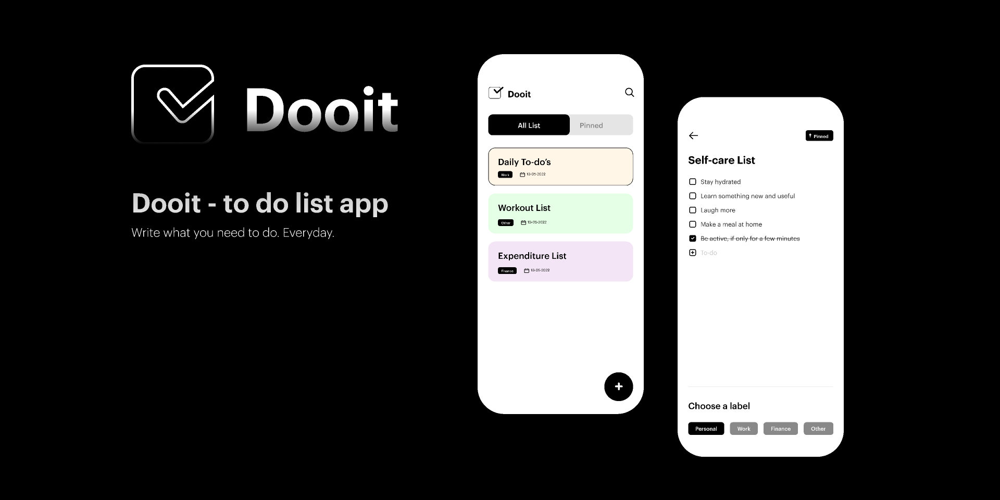
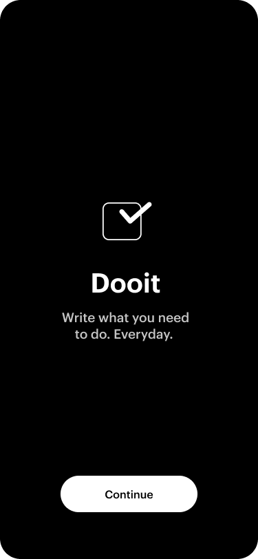

# Dooit - To-Do List App

Dooit is a straightforward and user-friendly to-do list application designed to help individuals manage their daily tasks and stay organized. 
Built using Kotlin and XML for the Android platform, Dooit provides a simple and intuitive interface for creating, editing, and managing tasks.
This application aims to simplify task management by allowing users to create lists of tasks, mark them as completed, and also receive reminders for important task.
With a focus on personal productivity, Dooit is designed for single-user usage, making it ideal for anyone with an Android phone looking to keep track of their daily activities.
The app's interface is built using XML layouts, providing a native Android experience. The backend logic is implemented in Kotlin, ensuring a smooth and efficient performance.
Dooit is developed using Android Studio, leveraging the platform's native tools and libraries.

## Features

* **Task Creation:** Easily add new tasks with descriptive titles.
* **Task Management:** Edit and delete tasks as needed to keep your list up-to-date.
* **Task Completion:** Mark tasks as completed to track your progress and stay motivated.
* **Task Reminders:** Receive timely reminders for important tasks, ensuring you don't miss deadlines.
* **User-Friendly Interface:** Enjoy a simple and intuitive interface designed for easy task management.
* **Personal Task Organization:** Designed for single-user usage, perfect for managing your personal to-do list.

## Technologies Used

* Kotlin
* XML (for layout)
* Gradle
* Android Studio
* Releated Andriod Libraries (Kotlin Courotines, Core Ktx, AppCompat, Espresso Core and etc.)

## UI Designer

The user interface for Dooit was designed by **Maietry Prajapati**. Their creative vision and attention to detail greatly enhanced the user experience.

* [Dooit Ui Design Figma](https://www.figma.com/community/file/1210926420668343883)

You can find more of their work at:

* [Maietry Prajapati Portfolio](https://bento.me/maietry)
* [Maietry Prajapati Figma Profile](https://www.figma.com/@maietryprajapat)

## App ScreenShots





## Getting Started

1.  Clone the repository:
    ```bash

    git clone [https://github.com/](https://github.com/)<your-username>/Dooit.git

    ```
2.  Open the project in Android Studio.
3.  Build and run the app on an emulator or physical device.

## Contributing

Contributions are welcome! If you find a bug or have an idea for a new feature, please open an issue or submit a pull request.

## License

This project is licensed under the MIT License.
